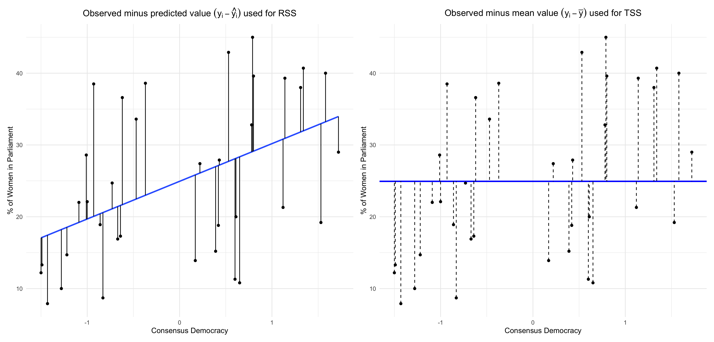

# 1. Lijphart's Dataset

Today we are going to look at the data used by Arend Lijphart in his 2012 book ‘Patterns of Democracy’. You are probably familiar with the book's argument from the Introduction to the Practice of Politics course. In short, Lijphart argues that democracies vary in the extent to which power is concentrated (‘majoritarian’ democracy) or dispersed (‘consensus’ democracy) along two dimensions:

+ The first, the *executives-party dimension*, relates to the extent of power-sharing *within* institutions. It distinguishes between countries where arrangements of the power require broad-based bargaining and inclusive policy-making on the one hand, and on the other hand countries that concentrate executive power in the hand of a bare majority or plurality. The former tend to have over-sized coalition cabinets, multipartism, strong parliaments relative to the executive, PR electoral systems and interest group corporatism; the latter tend to have single-party or bare ‘minimum winning’ coalition governments, two-party systems, strong executives relative to the legislature, disproportional electoral systems, as well as pluralist and fragmented interest groups. 

+ The second, the *federal-unitary dimension*, relates to the concentration or division of power *between* institutions. This dimension distinguishes between systems with strong federalism, bicameralism, rigid constitutions, strong judicial review and independent central banks on the one hand, and on the other hand countries with unitary territorial structures, concentration of power in one legislature, flexible constitutions, weaker judicial review and executive influence over central banks. 

Lijphart computes composite continuous indices of consensus democracy on both dimensions (in our datasets, these are called things like `exec_parties_1945_2010` or `federal_unitary_1945_2010`). Through some relatively simple statistical analysis that soon you will be able to replicate, Lijphart claims to find that the ‘consensus’ model on the executives-party dimension is associated with key desirable outcomes: higher social and economic equality, lower incarceration rates, better environmental protection, more gender parity. From this he concludes that consensus institutions make for a ‘kinder, gentler’ democracy. According to Lijphart's analysis, these advantages of the consensus model don't come at a cost for ‘hard’ indicators of performance like GDP growth, inflation, unemployment or social order; if anything, consensus democracies perform better than majoritarian ones on these measures too. 

The dataset used by Lijphart contains information on 36 democracies; a complete description of the variables in the dataset is in the ‘guide to Lijphart’ excel file. For today, the variables of interest for the purposes of our lab and the homework are the following:

 Variable                           Description
 ---------------------------------- ----------------------------------------------
 `ccodealp`                         Country code (isocode-3)
 `country`                          Country name
 `exec_parties_1945_2010`           Composite index of ‘consensus’ democracy on
                                    the executives-party dimension: 
                                    higher values = more consensual, 
                                    lower values = more majoritarian.
 `exec_parties_1981_2010`           Same, but computed post-1981
 `federal_unitary_1945_2010`        Composite index of ‘consensus’ democracy on
                                    the federal-unitary dimension: 
                                    higher values = more power division, 
                                    lower values = more power concentration.
 `federal_unitary_1981_2010`        Same, but computed post-1981 
 `womens_parl_representation_1990`  % of women in parliament (1990)
 `womens_parl_representation_2010`  % of women in parliament (2010)
 `cpi_1981_2009`                    average annual Consumer Price Index
                                    (change in price of a basket of goods)
 `incarceration_2010`               number of inmates per 100,000 people
 `unemployment_1991_2009`           average annual unemployment rate 
 `europe`                           Is the country in Europe? If yes, takes the
                                    value of 1; if no, takes the value of 0.
  ------------------------------------------------------------------------------

We are going to start by looking at women's parliamentary representation, and we ask whether --- as Lijphart would have it --- consensus democracy on the executives-parties dimension is positively related to this outcome variables. To start working with Lijphart's data, load `tidyverse` from the library (remember: you don't need to re-install it), and import the data from the working directory as we have learnt:

```{r eval=FALSE}
library(tidyverse)
setwd("~/Users/albertward")
lijphart <- read.csv("lijphart_data.csv")

setwd("~/")
getwd()
```

# 2. Measures of Dispersion: Variance and Standard Deviation

It's always a good idea to plot the variables we are interested in. Let's try a side-by-side boxplot of the variables `womens_parl_representation_1990` and `womens_parl_representation_2010`. 

```{r eval=FALSE}
ggplot(data = lijphart) + 
  geom_boxplot(mapping = aes(x = "1990", y = womens_parl_representation_1990)) + 
  geom_boxplot(mapping = aes(x = "2010", y = womens_parl_representation_2010)) + 
  xlab("Year") + ylab("Percentage of women in national parliaments")
```

Let's figure out what we can learn from a comparison of the boxplot of women's parliamentary representation in 1990 and that of women's parliamentary representation in 2010.

+ What do we learn from a comparison of the position of the thick black lines? How would you verify it computationally? 

```{r eval=FALSE}

median(lijphart$womens_parl_representation_1990)
median(lijphart$womens_parl_representation_2010)

```

+ What do we learn from a comparison of the height of the white boxes?

Hopefully, this should suggest to you that the values of `womens_parl_representation_2010` not only tend to be higher on average than those of `womens_parl_representation_1990` but also that they are more ‘spread out’. Of course, a visual inspection is not enough to reach this conclusion. Moreover, arguably the interquartile range shown by the boxplot is not an ideal measure of spread as it does not take outliers into account. 

To put a number to the spread of a variable distribution, we need to compute **measures of dispersion**. One of the most common measures of dispersion is the **variance**. 

Basically, the variance is computed as the mean squared difference between data values and the mean. For a variable $X$ with $n$ observations and a mean value of $\bar{x}$, the variance is computed as follows:
$$\mathrm{Var}(X) = \frac{\sum_{i=1}^{n} \left(x_{i} - \bar{x}\right)^{2}} {n-1}$$

In fact, this formula for the variance --- which is the one that will normally be useful to us --- is not strictly speaking a mean, as we do not divide the sum of squared differences by the number of data values but by that number *minus one*. This adjustment is known as Bessel's correction. 

The variance takes always positive values (the numerator is sum of squares, so all the elements are going to be positive). The minimum value the variance can take is 0: this is realised when all values of $x_i$ are identical to each other and to the mean $\bar{x}$: the sum in the numerator in that case will be 0, and consequently the variance will also go down to zero.

The function to calculate the variance of a variable in R is `var()`:

```{r eval=FALSE}
var(lijphart$womens_parl_representation_1990, na.rm = TRUE)
var(lijphart$womens_parl_representation_2010, na.rm = TRUE)

# remember: you have to pass na.rm = TRUE within the var() function 
# if there are missing values. These variables fortunately don't have NAs.
```

Was our intuition right? 

One drawback of the variance is that it's not easy to interpret substantively: it's not immediately clear what numbers like 90 or 130 mean substantively for our variables. Fortunately, we can use the *standard deviation* to talk more meaningfully about variable dispersion. The standard deviation $s$ of the variable $X$ is nothing but the squared root of the variance of $X$: 
$$s_X = \sqrt{\mathrm{Var}(X)} = \sqrt{\frac{\sum_{i=1}^{n} \left(x_{i} - \bar{x}\right)^{2}} {n-1}}$$
An aside on notation: the standard deviation is frequently notated with the Greek letter $\sigma$ (sigma). Technically, $\sigma$ is reserved to the square root of the variance computed *without* Bessel's correction (known as the population variance), while $s$ is normally used for the variance computed *with* Bessel's correction (known as the sample variance). The distinction between the two versions is virtually of no consequence for us here, but if this is what keeps you up at night, you can learn more about it [**at this link**](http://www.civil.uwaterloo.ca/brodland/EasyStats/EasyStats/Mystery_of_n-1_%28Part_1%29.html). The variance is very often notated as a function of the standard deviation --- as $s^{2}$ or $\sigma^{2}$. 

The function for the standard deviation in R is `sd()`, and it can be easily shown that it returns the same value as the squared root of the variance:

```{r eval=FALSE}
sd(lijphart$womens_parl_representation_1990)
sqrt(var(lijphart$womens_parl_representation_1990))

sd(lijphart$womens_parl_representation_2010)
sqrt(var(lijphart$womens_parl_representation_2010))
```

The advantage of the standard deviation is that it's expressed in the same unit as the variable: if your variable is in inches, the standard deviation is in inches; if it's in thousands of dollars per capita, the standard deviation is in thousands of dollars per capita. In the case of our variables, the standard deviation is in percentage points. In this sense, the standard deviation gives you an idea of how far ‘typical’ values of a variable tend to be from the mean. (This is something of an informal interpretation, as ‘typical’ here does not have a precise mathematical meaning. Most importantly, the standard deviation is **not** the *average* distance from the mean, because it's calculated from a sum of squares rather than a sum of absolute values.)

# 3. Measuring Relationships Between Variables: Covariance and Correlation Coefficient

The covariance is a measure of how two variables vary with each other. In other words, it gives you some information of how much *two* variables $X$ and $Y$ move together or apart. The formula for the covariance is as follows:
$$\mathrm{Cov}(X,Y) = \frac{\sum_{i=1}^{n} \left(x_{i} - \bar{x}\right) \left(y_{i} - \bar{y}\right)} {n-1}$$

As the name suggests, the  *co*-variance is a close relative of the variance. We can see that from the formula as well. To compute the variance of a variable $X$, (a) we subtract the mean of $X$ from all observations $X$, (b) square the result, (c) sum the result across observations, and (d) divide by the sample size minus one. To compute the covariance, (a) we subtract the mean from *two* variables, X and Y, and (b) multiply the two resulting values instead of squaring. In fact, the variance can be considered a special case of the covariance when $X = Y$. 

The R function to compute the covariance is `cov()`.

```{r eval=FALSE}
cov(lijphart$exec_parties_1945_2010, 
    lijphart$womens_parl_representation_2010)
```

 When one or both variables have missing values, you need to specify `use = "complete.obs"` in the function, as in this example with the inflation variable `cpi_1981_2009`:

```{r eval=FALSE}
cov(lijphart$exec_parties_1945_2010, 
    lijphart$cpi_1981_2009, use = "complete.obs")
```

In practice, we rarely interpret or report the covariance by itself, although it's a key ‘ingredient’ of two much more widely used indicators: Pearson's correlation coefficient and, as we will see later on, the Ordinary Least Squares (OLS) regression coefficient.

Unlike the variance, the covariance can take negative values when the two variable more ‘apart’: one increases as the other decreases. This is because the product $\left(x_{i} - \bar{x}\right) \left(y_{i} - \bar{y}\right)$ can return negative values. The sign of the covariance therefore gives us some information about the direction of the relationship. Like the variance, however, the covariance is hard to interpret substantively in terms of ‘how much’ two variables are related.

This is where the *correlation coefficient* (aka *Pearson's r* or *Pearson product-moment correlation coefficient*) comes in. The correlation coefficient $r$ of $X$ and $Y$ is defined as the covariance of $X$ and $Y$ ($\mathrm{Cov}(X,Y)$) divided by the product of the standard deviations of $X$ and $Y$ ($s_X s_Y$):

$$r_{X,Y} = \frac{\mathrm{Cov}(X,Y)} {s_X s_Y}$$

Why use Pearson's $r$ as a measure of correlation? Because it is constrained to vary only between $-1$ and $1$, with $-1$ indicating *perfect negative correlation*, $1$ indicating *perfect positive correlation* and $0$ indicating *no correlation at all*. In this sense, we can get a good idea of which pairs of variables show higher or lower degrees of correlation in our data (which we can't do with the covariance, which is unit-dependent).

The function to compute the correlation coefficient in R is `cor()`. 

```{r eval=FALSE}
cor(lijphart$exec_parties_1945_2010, 
    lijphart$womens_parl_representation_2010)
```

We can compute the correlation from its formula ‘by hand’ to make sure:  

```{r eval=FALSE}
covariance <- cov(lijphart$exec_parties_1945_2010, 
    lijphart$womens_parl_representation_2010)

product_of_standard_deviations <- 
  sd(lijphart$exec_parties_1945_2010)*
  sd(lijphart$womens_parl_representation_2010)

correlation <- covariance/product_of_standard_deviations

correlation

```

The argument `use = "complete.obs"` must be employed when you're dealing with missing values: 

```{r eval=FALSE}
cor(lijphart$exec_parties_1945_2010, 
    lijphart$cpi_1981_2009, use = "complete.obs")
```

---

*Extra Material: correlation matrices with tidyverse*: It's often useful to use `cor()` in conjunction with `select()` within `tidyverse` syntax to get correlation coefficients between more than one pair of variable (it is advisable to use `pairwise.complete.obs` in the `use =` argument):

```{r eval=FALSE}
lijphart %>% 
  select(exec_parties_1945_2010, 
                    womens_parl_representation_1990, 
                    womens_parl_representation_2010, 
                    cpi_1981_2009, 
                    incarceration_2010) %>% 
  cor(use = "pairwise.complete.obs") %>%
  round(3) 
#rounds output to the third decimal digit
```

# 4. Modelling Relationships Between Variables: Bivariate Linear Regression

So far we have learnt to describe relationship between variables. Regression develops this idea further, allowing you to *predict* the value of a dependent variable ($Y$) from one independent variable ($X$). In fact, unlike the correlation coefficient, regression allows you to model $Y$'s relationship to more than one independent variable at the same time. 

There are many possible regression models: what we are going to learn today is known as linear regression, or Ordinary Least Squares (OLS). It's known as *linear* regression because, in its simplest form it's an exercise in drawing a line across a scatter plot of observations. It's called *Ordinary Least Squares* because the specific line we are picking is the one that minimises the sum of squared errors (i.e. the distance between predicted and observed values). 

In its simplest form, the linear regression equation is expressed as the functional form of a straight line:

$$ Y_i=\alpha + \beta X_i $$
This is just an alternative notation of the $y=mx+c$ equation you learnt at school. We say that we ‘regress’ $Y$ on $X$ to mean that we're predicting an outcome $Y$ from a predictor $X$. 

At this point, there are some naming and notation conventions that it's worth learning:

+ $Y$ is known as the *dependent variable* (also: outcome variable, response variable, or regressand). 

+ $X$ is known as the *independent variable* (also: predictor, explanatory variable, regressor). 

In the equation $X$ and $Y$ are represented with a subscript $i$ because we want to indicate that the $i^{th}$ observation of the dependent variable is a function of the $i^{th}$ observation of the independent variable. That is, the proportion of women in parliament for the country in the $27^{th}$ row in our dataset should depend on the index of consensus democracy of the country in the $27^{th}$ row in our dataset. 

+ $\alpha$ is known as the *intercept* or the constant: graphically, it represents the point where the regression line intersects the $Y$ axis. Equivalently, it is the predicted value of $Y$ when $X$ is zero. 

+ Finally, $\beta$ is known as the *slope*: it represents how ‘steep’ the line is; **the slope is actually the coefficient we often care about the most when we run regressions as it expresses the nature of the relationship between variables.** $\beta$ is the change in $Y$ associated with a one-unit increase in $X$.

In reality, it's never the case that the dependent variable is a perfect function of the independent variable, so that the equation above is more precisely written with an *error term* $\epsilon_i$: 

$$ Y_i=\alpha + \beta X_i + \epsilon_i$$
The error term also comes with an indexed $i$, because each individual observation falls at some specific distance above or below the line we are fitting. This error term is crucial because it represent how ‘far’ the actual values are from our predictions.

The point of the regression is choosing $\alpha$ and $\beta$ so that the line ‘fits’ the data in a sensible way. By introducing an error term, we can define the criterion: we pick a line that makes these errors as small as possible. To be precise, OLS regression picks $\alpha$ and $\beta$ so that they **minimise the sum of squared errors** $\sum(\epsilon_i)^2$. That's why it's called *least squares*. (Other ways of minimising the error term are available, but OLS has a number of nice mathematical properties that have made it by far the most common way of estimating linear coefficients.)

The algebra of how OLS derives the regression coefficients is beyond the scope of the course. However, in the simplest case of a bivariate regression (i.e. one with only one independent variable) it can be shown that the slope coefficient $\beta$ is equal to the covariance of $X$ and $Y$ divided by the variance of $X$:

$$ \beta =\frac{\mathrm{Cov}(X,Y)}{\mathrm{Var}(X)} $$
The intercept $\alpha$ is the mean value of $Y$ (here notated as $\bar{y}$) minus $\beta$ times the mean value of $X$, notated as $\bar{x}$:

$$ \alpha =\bar{y} - \beta \bar{x} $$
The function to implement a linear regression in R is `lm()`, which stands for linear model. For a bivariate regression the `lm()` function takes the syntax `lm(Y_variable ~ X_variable)`. You can either specify the `data` argument separately or use the syntax with the extract operator `$`. The two codes are equivalent, though the first solution tends to be ‘tidier’:

```{r eval=FALSE}

lm(data = lijphart, womens_parl_representation_2010 ~ exec_parties_1945_2010)
lm(lijphart$womens_parl_representation_2010 ~ lijphart$exec_parties_1945_2010)

```

`lm()` returns the intercept and slope. But it's calculating at the same time some additional information, so it's often more useful to store the output under some name and the run the object created within the `summary()` function. 

```{r eval=FALSE}

my_model <- lm(data = lijphart, 
               womens_parl_representation_2010 ~ exec_parties_1945_2010)
summary(my_model)

```

We'll get to what all that means. But for now, it's very important that you get the interpretation of the regression coefficients (the numbers that appear in the `Estimate` column) right:

+ The intercept $\alpha$ is **the predicted value of Y when X is zero**: i.e. in this case, for a country that scores zero on the consensus democracy index, our prediction is that its parliament will have $24.9\%$ female representation in its parliament. It appears in the row marked as `(Intercept)`, under the `Estimate` column of regression summary.

+ The slope $\beta$ is **the expected change in Y when X increases by one**: i.e. in this case, our prediction is that an increase of one unit in the consensus democracy index is associated with an increase of $5.2$ percentage points in the predicted share of women in parliament. This coefficient appears in the row with the $X$ variable name (in this case, `exec_parties_1945_2010`), under the `Estimate` column of regression summary. When the value of $\beta$ is positive, it implies a positive relationship between the variables (one increases as the other increases); when it's negative, it implies a negative relationship (one increases as the other decreases, and vice versa). 

You can actually compute ‘by hand’ the predicted value of $Y$ for hypothetical values of $X$. What's the predicted value of `womens_parl_representation_2010` when `exec_parties_1945_2010` is, say 1.25? Or, say, -0.5? Or again, the extreme values of the variable we actually observe (the most ‘majoritarian’ and the most ‘consensus’ countries)?

```{r eval=FALSE}
24.938 + 5.248*(1.25)
24.938 + 5.248*(-0.5)
24.938 + 5.248*(min(lijphart$exec_parties_1945_2010))
24.938 + 5.248*(max(lijphart$exec_parties_1945_2010))
```

```{r}
library(ggeffects)
ggpredict(my_model, "exec_parties_1945_2010 [-1.5:1.72]")
```


# 5. Plotting Bivariate Regression Lines in Scatter Plots

We have already learnt how to visualise the relationship between two continuous variables. By convention, the dependent variable --- the thing we want to ‘explain’ --- belongs on the y-axis, while the independent variable --- the input that we think ‘explains’ the outcome --- goes on the x-axis:

```{r eval=FALSE}

ggplot(data = lijphart) + 
  geom_point(mapping = aes(x = exec_parties_1945_2010, 
                           y = womens_parl_representation_2010)) + 
  xlab("Consensus Democracy (Executives-Party Dimension)") + 
  ylab("Percentage of Women in Parliament")

```

Now that we've learnt how to derive regression coefficients, we can plot the line $Y =\alpha + \beta X$ through the data points using the `geom_smooth()` function. We need to specify the `method="lm"`, as we want to reproduce the output of the linear model; moreover, we need to repeat the aesthetic parameters for `x` and `y`. By default, it will plot the confidence interval around the line; as we haven't covered what the confidence interval means yet, for now we specify `se = FALSE`. 

```{r eval=FALSE}

ggplot(data = lijphart) + 
  geom_point(mapping = aes(x = exec_parties_1945_2010, 
                           y = womens_parl_representation_2010)) + 
  xlab("Consensus Democracy (Executives-Party Dimension)") + 
  ylab("Percentage of Women in Parliament") + 
geom_smooth(method="lm", mapping = aes(x = exec_parties_1945_2010, 
                           y = womens_parl_representation_2010), se = FALSE)
```

From the plot we can note that, as discussed when interpreting the regression coefficients, where `exec_parties_1945_2010` is zero, the dependent variable is just shy of 25 (our $\alpha$ was 24.9). Moreover, moving from 0 to 1 on the `exec_parties_1945_2010` axis corresponds to an increase in the dependent variable of about 5 points, from about 25 to about 30: this corresponds to our $\beta$ of 5.2. 

---

*Extra material: aes() placing in a complex ggplot*: to make your life easier, you can pass the `aes()` argument within the `ggplot()` call; in this way both `geom_point()` and `geom_smooth()` will inherit the same parameters (in this case, the x and y variables). 

```{r eval=FALSE}
ggplot(data = lijphart, mapping = aes(x = exec_parties_1945_2010, 
                           y = womens_parl_representation_2010)) + 
  geom_point() + 
  xlab("Consensus Democracy (Executives-Party Dimension)") + 
  ylab("Percentage of Women in Parliament") + 
geom_smooth(method="lm", se = FALSE)
```

# 6. How good is our model? The $R^2$

Now that we've learnt how to ‘fit’ a bivariate regression, model interpret the coefficient, and plot it, we may be interested in asking ‘how good’ is our model? In other words, how well does the line fit the data points? Perhaps the data visualisation above might have given you the impression that the relationship we found is actually quite a lousy fit given how scattered the observations are. This is debatable (good relative to what? Bad relative to what?), but it's sometimes useful to assess the ‘goodness of fit’ of a model.

The most widely used statistic to assess model fit is known as **coefficient of determination** or $R^2$. It's defined as 1 minus the ratio between the Residual Sum of Squares (RSS) and the Total Sum of Squares (TSS):

$$R^{2} = 1 - \frac{RSS}{TSS} = 1- \frac{\sum_{i=1}^{n} \left(y_{i} - \hat{y}\right)^2} {\sum_{i=1}^{n} \left(y_{i} - \bar{y}\right)^2}$$
In turn:

+ The RSS in turn is the sum of the squares of the distances between *observed* ($y_{i}$) values of the dependent variable and the values of the dependent variable *predicted* ($\hat{y}$) by the model.

+ TSS is the sum of squares of the distances between *observed* ($y_{i}$) values of the dependent variable and the *average* value of the dependent variable ($\bar{y}$).

The figure below shows what the residuals $(y_i - \hat{y_i})$ look like as thick lines on the left-hand side plot, and the deviations from the mean as dashed lines on the right-hand side plot. The sum of squares of these distances are used to compute, respectively, the RSS and the TSS, and in turn the $R^{2}$.

{width=100%}

It's not very important at this point to memorise how to calculate the $R^{2}$. However, you want to remember how to interpret it: it's the **proportion of variance in the dependent variable explained by the model**. So, if you get a $R^{2}$ of 0.30, your model explains $30\%$ of the variation in the outcome. 

That said, **your goal in life is not to maximise the** $\bf{R^{2}}$. The social processes we study are messy and have an inherent element of randomness, so that we rarely get to make parsimonious models that explain all their manifestations. However, being able to model general tendencies amid a lot of noise can still be useful: imagine how much money you could make if you came up with a model that predicts even just $10\%$ of the change in stock market performance in a year's time.

The $R^{2}$ is shown in the `summary()` of a regression at the bottom of the table:

```{r eval=FALSE}
summary(my_model)
```

R provides two values: the Multiple R-squared (i.e. the ‘normal’ $R^{2}$) and the Adjusted R-squared. The Multiple R-squared is the version we've described here, and can be safely used in bivariate regressions. So, we can say that consensus democracy index explains about $21\%$ of the variation in female representation in parliament in Lijphart's sample of country. 

In multivariate regressions (next lab's topic), normally the Adjusted R-squared is interpreted. The difference between the two is that the Adjusted version penalises the model when you add ‘pointless’ explanatory variables, while the Multiple R-squared will always increase as you add independent variables. 

# 7. Exporting Regression Results with `stargazer`

We are going to learn how to intepret the various estimates in the `summary()` output in the classes and in the final lab. For now, suffices to say that we want to present some more information alongside the regression coefficients. The last skill we are learning today is how to get that output onto your essay. To do so, we need to install the `stargazer` package. 

```{r eval=FALSE}
install.packages("stargazer")
library(stargazer)
```

Now let's run a bivariate regression model, and give it some name: 

```{r eval=FALSE}
model_unemployment <- lm(data = lijphart, 
                         unemployment_1991_2009 ~ exec_parties_1945_2010)
```

Then, let's pass the model within the `stargazer()` function. Basically, there are two useful things you can do with stargazer at this stage:

+ adding `type = "text` as argument *prints in your console* a tidy regression table
+ adding `out = "some_name.html"` *saves in your working directory* a tidy regression table in html format, which you can then copy-paste into a word document etc. This will be very useful for your essay. 

```{r eval=FALSE}
stargazer(model_unemployment, type = "text")
stargazer(model_unemployment, out = "unemployment_regression.html")
```

# Homework

+ create a vector `x` comprising six numbers: 4, 7, 9, 11, 11 and 20. Using the formula of the variance in this lab sheet, compute the variance of `x` ‘by hand’ (i.e. not using the `var()` function). The functions you need are `mean()`, `sum()`, `length()`, as well as some mathematical operators. Tip: you can make your life easier by breaking down the process into steps and storing intermediate results under some name. Verify your result with the `var()` function. 

+ Go back to the `lijphart` dataset, regress `incarceration_2010` on `exec_parties_1981_2010` (i.e. use regression to explain the number of incarcerated people per 100,000 residents as a function of the index of consensus democracy). How do you interpret the intercept and slope coefficients? What does this suggest for Lijphart's thesis about the effects of consensus democracy? Compute the $\beta$ and $\alpha$ coefficients by hand using the formulas provided in section 4 of this lab sheet. Then, plot the regression line on a scatter plot of the two variables. Finally, store the regression output as a html file. 

+ Inspect the variable `europe` in the `lijphart` dataset, and consult the variable description in the lab sheet. What values does it take? What do they correspond to? Variables like these are known as ‘dummy’ or ‘binary’ variables. Now regress `womens_parl_representation_2010` on `europe`. How do we interpret substantively the slope coefficient? Tip: think about what it means to move from 0 to 1 on the independent variable, given what those values represent. What does the intercept mean? Tip: think about what it means for $X$ to be 0, so that $Y = \alpha + \beta(0) = \alpha$. 

+ Merge the `lijphart` dataset with the `ppi` dataset we used in week 4's lab (`ppi.csv` file), using `ccodealp` as the merging variable, and one of the functions of the `join()` family. Now compute the correlation coefficient of `parl_power_index` (the Parliamentary Power Index score computed by Fish and Kroeger, where higher = stronger parliament) and `exec_parties_1945_2010` (Lijphart's measure of ‘consensus’ democracy within institutions, where higher = more consensual). How do you interpret substantively the result? Does it make sense to you? 
