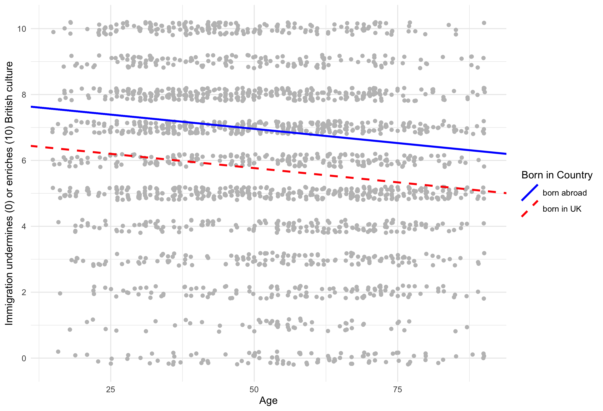
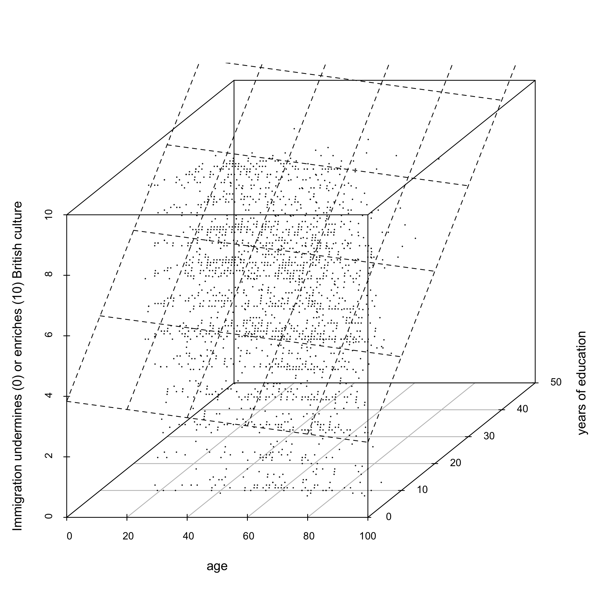
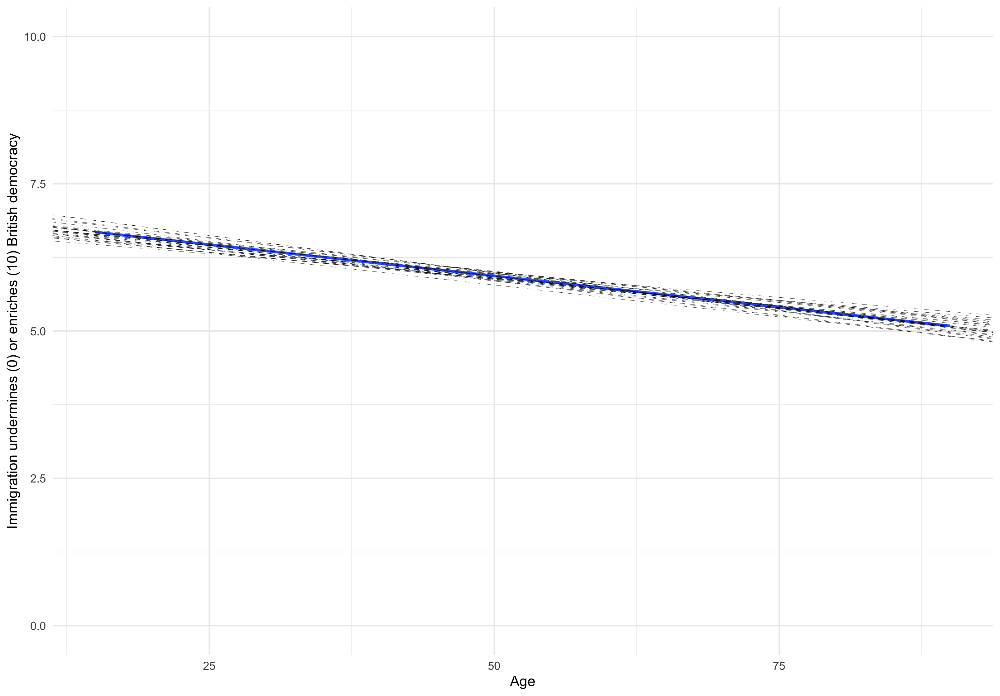

# 1. European Social Survey (ESS) Data

This lab we're working with **survey data**: the UK sample of the 2018 European Social Survey (wave 9), a cross-country survey that has allowed scores of researchers to compare people's political attitudes and behaviour (and more) across 40 countries over 20+ years. Unlike the previous datasets we worked with, the observations here are *people*: each row corresponds to a respondent. The full data has been subsetted to the British sample, and has been cleaned up and trimmed down for the purposes of this lab. The full data are publicly available following registration [**at this link**](https://www.europeansocialsurvey.org/data/). 

The ESS has hundreds of variables, but these are the ones we'll use the lab:

 Variable                           Description
 ---------------------------------- --------------------------------------------
 `idno`                             respondent's ID number    
 `cntry`                            country ("GB" for all)     
 `agea`                             age of respondents    
 `gndr`                             gender (0 = men, 1 = women)    
 `brncntr`                          born in the UK (0 = no, 1 = yes)       
 `eduyrs`                           years spent in formal education      
 `imueclt`                          0-10 scale answer to the question: “Would you say that the UK's cultural life is
                                    generally undermined or enriched by people coming to live here from other 
                                    countries?” where 0 = undermined and 10 = enriched.      
 `domicil`                          respondent descr. of place of residence: ‘A big city’, ‘Suburbs or outskirts of 
                                    big city’, ‘Town or small city’, ‘Country village’, ‘Farm or home in countryside’.
 `maritalb`                         Marital status: 1 = ‘married’, 2 = civil union, 3 = separated, 4 = divorced, 
                                    5 = widower, 6 = never married or in a civil union.
  ------------------------------------------------------------------------------

Let's start as usual by loading `tidyverse` and `stargazer`, setting the working directory and importing the data.

```{r eval=FALSE}
library(tidyverse)
library(stargazer)
setwd("~/Desktop/QStep")
ess <- read.csv("ess9_gb.csv")
```

Substantively, in this lab we are going to be looking mainly at attitudes to immigration, a core issue in contemporary politics. The ESS has many different survey item on immigration, which you might want to explore on your own. Here we focus on `imueclt`, a variable that records respondents' answer to the question: “Would you say that the UK's cultural life is generally undermined or enriched by people coming to live here from other countries?” Respondents are asked to give their answer on a scale from 0 to 10 where 0 is ‘undermined’ and 10 is ‘enriched’. 

Perhaps controversially, **we are going to treat this variable as a continuous variable**. Technically, `imueclt` is ordinal, because respondents can't answer e.g. 3.25; plus, it's not immediately clear that someone answering ‘8’ is twice as pro-immigration as someone answering ‘4’. However, research practice has found that these survey items (known as ‘Likert scales’), when designed properly, can work as a decent approximation of continuous variables, allowing us to conduct quantitative analysis on people's attitudes and preferences (see for instance [Wu and Leung, 2017](https://www.tandfonline.com/doi/full/10.1080/01488376.2017.1329775)).

# 2. Recap: Bivariate OLS

In the last lab, we introduced bivariate linear regression. From what you've learnt, what can you say about the relationship of age and attitudes to immigration from the following regression output?

```{r eval=FALSE}
model1 <- lm(data = ess, imueclt ~ agea)
summary(model1)
```

---

*Extra Material: Plotting Jittered Data*. We have also learnt how to plot this information. With dependent variables like `imueclt`, which can take a finite number of values, it's advisable to use `geom_jitter()` instead of `geom_point()`, to introduce a bit of random scattering of the point around the actual value, so as to show which parts of the plot are more crowded and which ones are emptier. You can control how much jitter you allow with the parameters `width` and `height`. (We're also plotting the confidence interval because we'll get to what they mean at the end of the lab.)

```{r eval=FALSE}
ggplot(data = ess, mapping = aes(x = agea, y = imueclt)) +
  geom_jitter(width = 0.2, height = 0.2) +
  geom_smooth(method = "lm")

# Multivariate
ggplot(data = ess, mapping = aes(x = agea, y = imueclt, group = 1)) + 
  geom_jitter(width = 0.2, height = 0.2) + 
  geom_smooth(aes(group = 1), method = "lm", se = FALSE) +
  geom_smooth(aes(y = imueclt - 1.19, group = 2), method = "lm", se = FALSE, linetype = "dashed") +
  scale_color_manual(values=c("black", "red"), guide = FALSE)

```

---

Now let's consider how to interpret a binary regression when we are using a ‘dummy’ variable as predictor (this was covered in the exercise section of week 6's worksheet). The variable `brncntr` (‘Born in Country’) records information on respondents' birth country as a binary outcome: if the respondent was born *outside* the UK, it takes the value of 0; if the respondent was born *in* the UK, it takes the value of 1. 

+ Intuitively, how do you think being born inside or outside the UK should be related to attitudes to immigration? 
+ Given how it's structured, what does a ‘one-unit increase’ in the ‘Born in Country’ variable mean?
+ So, is your intuition confirmed by the output of the following regression?

```{r eval=FALSE}
model2 <- lm(data = ess, imueclt ~ brncntr)
summary(model2)
```

# 3. Multivariate OLS 1: The Simplest Case

Now let's think about our finding that as age increases, respondents' answer to `imueclt` tends to take lower values --- i.e. older people are on average more negative about the effects of immigration on British culture. Now we may ask ourselves: is this really an ‘age effect’ or a spurious relationship? In light of what we found in our model 2, we may think for instance that the association between age and immigration attitudes is not so much a matter of a generational value divide, but mostly due to the fact that younger generations are more likely to be foreign-born than older generations, and it's actually that aspect of a person's background that matters in shaping attitudes to immigration. 

If this is true, when we compare ‘like with like’ --- i.e. UK-born respondents to UK-born respondents, and foreign-born respondents to foreign-born respondents --- then we might find that age has no effect, or a weaker effect, or even the ‘opposite’ effect (this is known as [**Simpson's paradox**](https://en.wikipedia.org/wiki/Simpson%27s_paradox)). 

Multivariate regression helps us solve these kinds of issues. While the maths behind it can get quite complex, their equations are simple: we're just adding additional variables, with their own slope coefficients, to a bivariate model. For instance, if we want to model ‘Immigration attitudes’ as a function of ‘Age’ and ‘Born in Country’, the multivariate linear regression functional form would be:
$$ Immigration~Attitudes_i = \alpha +\beta_1(Age_i) + \beta_2(Born~in~Country_i) +\epsilon_i $$
To run a multivariate regression in R, you simply add independent variables to the right-hand side of the formula (to the right of the tilde `~`), separated by a `+` sign:

```{r eval=FALSE}
model3 <- lm(data = ess, imueclt ~ agea + brncntr)
summary(model3)
```

Again, the `lm()` function is picking for you the coefficients that minimise the squared sum of error terms: only, this time it's picking three of them ($\alpha$, $\beta_1$ and $\beta_2$): one for the intercept and two for the two independent variables. How to interpret the results? Each variable comes with its own coefficient: that's still the predicted change in $Y$ for a one-unit change in that variable, but this time we have to specify **‘holding all other predictors constant’**. For example, here we can say:

+ *holding respondents' country of birth constant*, each additional year is associated with a $0.017$ point decrease in respondents' answers to the immigration question, where lower values indicate that the respondent thinks UK cultural life is undermined by immigration. More succinctly: net of the effect of country of birth, age is negatively associated with evaluations of the cultural effects of immigration.

+ Similarly, *holding respondents' age constant*, UK-born respondents' answers are on average 1.19 points lower than those of respondents born abroad, where lower values indicate that the respondent thinks UK cultural life is undermined by immigration. More succinctly: net of age, UK-born respondents have more negative evaluations of the cultural effects of immigration than foreign-born respondents.

In a multivariate regression, the variables we add to check whether they affect the coefficient of the variable we're substantively interested in are sometimes known as ‘controls’. In this sense, if the predictor we are investigating is ‘Age’, we might also say: ‘age is negatively associated with pro-immigration attitudes *controlling for country of birth*’. 

What's the predicted value of `imueclt` for a 70-year old UK-born respondent? What about a 30 year-old foreign-born respondent?

```{r eval=FALSE}
7.824318 + -0.017299*70 + -1.192334*1
7.824318 + -0.017299*30 + -1.192334*0
```

Note that when we include both ‘Age’ and ‘Born in Country’, the coefficients of the two variables are different from what we observed in the bivariate regressions. Our friend `stargazer` is great for visualising different regression outputs side by side:

```{r eval=FALSE}
stargazer(model1, model2, model3, type = "text")
```

Both the coefficient for ‘Age’ and for ‘Born in Country’ have become smaller in their absolute value (the slopes have become ‘flatter’). This suggests that part of the variation in attitudes explained by ‘Age’ in model 1 was actually due to differences in background of older and younger respondents, and part of the variation in attitudes explained by ‘Born in Country’ in model 2 was actually due to the different age composition of UK and foreign-born respondents. However in both cases the direction of the association has remained negative even in model 3. 

Note also that the $R^2$ increases in the multivariate model relative to the two bivariate model: this means that we're explaining more of the variation in `imueclt` with a model that takes into account both variables. (In multivariate regressions, the Adjusted $R^2$ is generally discussed.)

---

*Extra Material: Visual Intuition for a Simple Multivariate Regression*. We can think of a multivariate regression with a continuous and a dummy in terms of ‘fitting two lines’. The slope for both is the same (i.e. the slope coefficient for ‘Age’). The intercept is different for the two groups of the dummy: it's the constant printed in the regression output (7.82) for the group that takes the 0 value of the dummy (foreign-born respondents), it's the constant plus the dummy coefficient ($7.82 + (-1.19)$) for the groups that takes the 1 value of the dummy (UK-born respondents). 

For our regression model, this is what the two lines look like:

{width=80%}

# 4. Multivariate OLS 2: More Complex Models

You can fit models of the type $Immigration~Attitudes_i = \alpha +\beta_1(Age_i) + \beta_2(Born~in~Country_i) +\epsilon_i$ with new variables: you're not restricted to two predictors. Indeed, very often you do want to add more than one control variable to your model, so as to ‘net out’ the effect of many possible factors confounding the relationship between the predictor we're interested in and the dependent variable. 

Just now, we wondered whether the relationship between age and immigration attitudes was confounded by the fact that older people are less likely to be born abroad. But older and younger people differ in all sorts of different ways that may be related to attitudes to immigration: e.g. older people tend to have fewer educational qualifications, are more likely to live outside large cities, are less likely to be single --- it's also the case that they're slightly more likely to be women, as life expectancy in the UK is slightly higher for women than for men. If all these things that co-vary with age (education, residence, marital status, gender etc.) had an independent effect on immigration attitudes, our estimate for the slope of the age variable would be biased. As discussed, when we introduce extra variables in a model alongside our independent variable of interest (age), we say that we're *controlling* for e.g. education, gender, marital status etc. 

## 4.1 Two Continuous Predictors

Let's now try to explain `imueclt` as a function of two continuous variables: the respondents' age and number of years of education (`eduyrs`).

```{r eval=FALSE}
model4 <- lm(data = ess, imueclt ~ agea + eduyrs)
summary(model4)
```

+ How do you interpret the slope coefficients for the two independent variables? 

+ How much variation are we explaining in this model? How does the new model fare compared to model 3? 

---

*Extra Material: Visual Intuition for a Simple Multivariate Regression*. Thinking about multivariate regressions in geometric terms (as in ‘fitting a line’) gets harder and harder as you make the model more complex. In the case of model 4, for instance, we're fitting a plane in a three dimensional ‘cloud’ of points so as to minimise the squared sum of the distances between points and the surface of the plane. The inclination of the plane's sides are the slopes of the two independent variables. 
{width=100%}

## 4.2 Three or More Predictors

Because humans have limited three-dimensional brains, when we add more than two independent variables we can't easily visualise the whole model, as we're fitting ‘hyperplanes’ in n-dimensional clouds. For this reason, being able to interpret the coefficients of a regression output is key: from now on we won't be able rely on visual intuition. Fortunately, as we add predictors, the interpretation of individual slope coefficients is the same as we've learnt in our simpler cases. 

For instance, let's fit this model:
\begin{align}
\begin{aligned}
Immigration~Attitudes_i = \alpha +\beta_1(Age_i) + \beta_2(Born~in~Country_i) + \\ \beta_3(Years~of~Education) + \beta_4(Gender) +\epsilon_i 
\end{aligned}
\end{align}

Where ‘Age’, ‘Born in Country’ and ‘Years of Education’ are the variables we've already seen, and ‘Gender’ is a dummy that takes the value of 0 for men and 1 for women (regrettably, the ESS does not offer other options). 

How do you interpret the slope coefficients in this regression output? 

```{r eval=FALSE}
model5 <- lm(data = ess, imueclt ~ agea + brncntr + eduyrs + gndr)
summary(model5)
```

## 4.3 Categorical Predictors

Let's now consider the variable `domicil` (let's call it ‘Residence’). It's a categorical variable that stores respondents' answer to the question ‘Which phrase on this card best describes the area where you live?’ under the following categories:

+ `"city"` for ‘A big city’
+ `"suburbs"` for ‘Suburbs or outskirts of big city’
+ `"town"` for ‘Town or small city’
+ `"village"` for ‘Country village’
+ `"countryside"` for ‘Farm or home in countryside’

```{r eval=FALSE}
table(ess$domicil)
```

What if we wanted to understand how the type of context respondents live in affects their attitudes about immigration? Recently, there has been a lot of talk, for instance, about ‘left behind places’ and the role of spatial inequalities in driving the success of anti-immigration politics in these areas.

The way we handle variables like this in R is an extension of the way we used binary variables like ‘Born in Country’ (`brncntr`) and ‘Gender’ (`gndr`). What we could do is to create new binary variables and throw them in the regression model: for instance, we could create a `city` variable that takes the value of 1 when `domicil == "city"`, and 0 otherwise, a `suburb` variable that takes the value of 1 when `domicil == "suburb"` and so on. By now, we should know how to interpret the resulting coefficients. 

However, R allows you to use categorical variables directly in the regression model; the programme will effectively code your dummies for you automatically. Let's see what happens if we add ‘Residence’ (`domicil`) to model 5. 

```{r eval=FALSE}
model6 <- lm(data = ess, imueclt ~ agea + brncntr + eduyrs + gndr + domicil)
summary(model6)
```

You'll notice that each possible answer gets its coefficient, except one, `city`. This is because `city` is the ‘reference category’: the four coefficients we get are the expect change in the dependent variable associated with going from `city` to the corresponding category. For instance, the regression suggests that countryside residents are predicted to score 0.53 points lower *than big city residents* on the dependent variable; suburbanites are predicted to score 0.40 points lower *than big city residents*; town residents are predicted to score 0.28 points lower *than big city residents*; village residents, 0.42 points lower *than big city residents*. In this sense, categorical variables can be used as predictors and the resulting coefficient for each category is always interpreted in terms of the difference between the reference category and the category itself.

---

*Extra Material: Changing the Reference Category*. R automatically picks the first category in alphabetical order as reference category. Mathematically, it makes no difference which reference category you pick, but sometimes you're interested specifically in the difference between certain pairs of categories, so it might be handy to change it if it helps with interpretation. You can change the reference category (for instance, to `"town"`) with the following syntax:

```{r eval=FALSE}
ess$domicil <- relevel(as.factor(ess$domicil), ref = "town")
```

*Extra Material: Treating Numerical Variables as Categorical*. Sometimes categorical variables are coded with numbers (this is normally the case with ESS ‘raw’ data pulled directly from the website). For instance, the variable `maritalb` (‘Marital status’) looks like this: 

+ `1` means ‘Legally married’
+ `2` means ‘In a legally registered civil union’
+ `3` means ‘Legally separated’
+ `4` means ‘Legally divorced/Civil union dissolved’
+ `5` means ‘Widowed/Civil partner died’
+ `6` means ‘None of these (never married or in legally registered civil union)’

Of course these numbers have no real meaning (what does it mean that a separated person has 3 times more ‘marital status’ than a married person?). They're just placeholders. 

When you want to use variables like these in a regression, you can either code a new categorical variable with sensible text labels, or use `as.factor()` within the `lm()` function. This will tell R to treat the variable as categorical even if it's a number (‘factor variable’ is jut another name for ‘categorical variable’). Of course, remember when you present the results to tell the reader what these numbers mean in the regression table. The code below re-reruns model 6, but with the ‘Marital Status’ variable instead of ‘Residence’:

```{r eval=FALSE}
model6_b <- lm(data = ess, imueclt ~ agea + brncntr + 
                 eduyrs + brncntr + as.factor(maritalb))
summary(model6_b)
```

Again, the coefficients for ‘people in civil union’ (2), ‘separated’ (3), ‘divorced’ (4), ‘widowed’ (5) and ‘single’ (6) tell you the difference between each of these categories and the reference category, ‘married’. 

# 6. Uncertainty and Significance

So far, we've concentrated on the regression coefficients. Regression coefficients very important estimates, as they tell us the direction and size of the association between variables, and allow us to make predictions on the basis of a ‘model’ of the process that generated the data we observed. But *direction* and *size* are not the only things we're interested in: we also want to convey to the reader a sense of the confidence we have in our estimates. 

We are now going to look at two statistics that appear in the output of a regression (and should appear in your tables too): the **standard error** and the **p-value**. These are both fairly sophisticated concepts, and normally the aspects of statistics courses that beginners struggle the most to get their heads around. Our focus here will be on figuring out these things in R, and being able to give an interpretation. Much more thorough discussions of the statistical meaning of the standard error and the p-value are given in the class slides (weeks 7 and 8) and in Kellstedt and Whitten's (2018) textbook [**‘The Fundamentals of Political Science Research’**](https://www.cambridge.org/highereducation/books/the-fundamentals-of-political-science-research/D216914982BC901C8E50461818D387A7#overview) (chapters 7-8-9).

Both concepts rely on the idea of sampling from a population: the data we observe, the **sample**, are drawn from a larger **population**, which we don't observe. The sample is drawn at random, and therefore without bias. But each sample will be a bit different from another, because of the randomness involved in the sampling process. Uncertainty and significance tell us something about the confidence we have that the statistics we estimate in the sample reflect those in the population. 

Our case of a survey like the ESS is actually helpful here to get this intuition, because our data, comprising variables from about 2200 individuals, are actually a sample drawn from a much larger population, that of UK adults (in reality, survey sampling is never truly random, but for now let's not worry about that). However, even when we work with data that aren't actually random samples (the `lijphart` dataset) or samples at all (the `qog` dataset), we use the very same ‘fiction’ that the data has been drawn from a larger population to discuss uncertainty and significance. It's just a bit more of an abstraction in those cases. 

## 6.1 Standard Errors and Confidence Intervals of the Coefficients

In model 6, we found that age predicts negative evaluations of immigrants' effect on British culture and that the size of this ‘effect’ is a certain estimate, $\beta_1$. Specifically, our estimate is $-0.0099$ points on a 0-10 scale for every additional year. Assuming we've actually done a good job --- included all the necessary controls etc. --- how confident should we be about this finding? It is, after all, still a number we got from a sample, not the ‘true’ value of the slope in the population.

The standard error addresses this concern by answering the question: **if we were to take many, many other samples of the same size as our data, and re-run the exact same regression model, how much would our $\beta_1$ vary?** If we were to do this, sometimes we'd estimate a bit more than $-0.0099$, sometimes a bit less. The standard error is the standard deviation of all these values of $\beta_1$ we'd get throughout this process of re-sampling: the bigger it is, the less confident we should be about the value of $\beta_1$ we found in our sample. (And, of course, we can ask the same question about $\alpha$, $\beta_2$, $\beta_3$ etc.)

The standard errors of every regression coefficient appear in the column ‘Std. Error’ of the `summary()` of a regression, and in parentheses under their respective coefficient in a `stargazer` table:

```{r eval=FALSE}
summary(model6)
stargazer(model6, type = "text")
```

A useful way in which we can convey the uncertainty represented by $SE(\beta_1)$, the the standard error of the slope coefficient for ‘Age’, is calculating the $95\%$ confidence interval of the coefficient. The confidence interval consists of two values: an ‘upper’ and a ‘lower’ bound. In our case, it's notated as $CI^{\beta_1}_{0.95}$, and it's approximately:

$$CI^{\beta_1}_{0.95} \approx \beta_1 \pm 1.96\times SE(\beta_1)$$
For instance, in our case, where the coefficient for ‘Age’ is $-0.0099$ and the standard error is $0.0030$:

```{r eval=FALSE}
upper_ci <- -0.009933 + 1.96*0.003044
upper_ci
lower_ci <- -0.009933 - 1.96*0.003044
lower_ci
```

The confidence interval is defined as the interval of values such that with 95% probability the range will include the ‘true’ (unobserved) value of $\beta_1$. Another way of saying this: if we took many many samples from the population, each time derived our regression coefficient and calculated the confidence interval, $95\%$ of the time that range would include the true population parameter. 

---

*Extra Material: More on the Confidence Interval*. Where does the 1.96 come from? 

+ thanks to the Central Limit Theorem, we know that the distribution of all these coefficients we estimate in the repeated samples will be a **normal distribution**.

+ we know that in a normally distributed variable, $95\%$ of the observations are within 1.96 standard deviations from the mean. 

+ The standard error is, by definition, the standard deviation of the sampling distribution of the estimate. 

The formula above is actually a (very good!) approximation; you can get the exact bounds of all the regression's coefficients with the `confint()` function in R. 

```{r eval=FALSE}
confint(model6)
```

Note that $95\%$ is a convention. If you wanted the $90\%$ confidence interval, you'd use 1.65 instead of 1.96; for the $99\%$ confidence interval, you'd use 2.58 etc. Or just specify `confint(model6, level = 0.99)` in the function. 

---

*Extra Material: Plotting the Confidence Interval of a Regression Line*. Through visualisation, we can get a better intuition of how the confidence interval is computed in the simplest case of a bivariate regression. Let's go back to our `model1`, where we were regressing `imueclt` on ‘Age’. The figure below shows the regression line of the model we actually estimated from ESS data (blue solid line) against the slope coefficients obtained through re-sampling the data and re-running the same model on the new data a bunch of times. As you can see, sometimes the slope is a bit steeper, sometimes it's a bit flatter. 

{width=100%}

Now, `ggplot`'s `geom_smooth()` function actually plots the same information: the gray area around the regression is the range in which the regression lines with slopes within the $95\%$ confidence interval of the observed slope coefficient fall. The confidence intervals of a regression line have a characteristic shape: narrower around the mean and broader at the tails, exactly like the ‘bundle’ of regression lines obtained through re-sampling. By default, R plots the confidence interval at the $95\%$ level. 

```{r eval=FALSE}
ggplot(data = ess, mapping = aes(x = agea, y = imueclt)) + 
  geom_smooth(method = "lm") +
  xlab("Age") + ylab("Immigration undermines (0) or enriches (10) British democracy") +
  ylim(0,10) + theme_minimal()
```

## 6.2 Statistical Significance: the p-value of a Coefficient

The **p-value** of a regression coefficient is a statistic used in the context of null hypothesis testing. Like the standard error, it relies on the same notion of a larger (unobserved) ‘population’ from which we're sampling randomly some (observed) data. 

Our starting point is again the value of $\beta_1$ we estimate in our sample. Now, we make the assumption that, if we were to fit our model to the data in the population, there would be absolutely no association between age and immigration attitudes. **In other words, we assume that the value of $\beta_1$ in the population is zero.** This scenario is known as the ‘null hypothesis’. 

Under this scenario, **how likely is it that we just got unlucky and estimated a coefficient as far from zero as $\beta_1$ just because of the randomness of the sampling process?** The p-value expresses the answer to this question in terms of a probability. More precisely, the p-value is the probability of obtaining an estimate at least as extreme as the estimate actually obtained, under the assumption that the null hypothesis is correct. This probability is expressed as a number comprised between 0 and 1. 

The p-value of the regression coefficients appear in the ‘Pr(>|t|)’ column of the `summary()` of a regression, alongside some stars that indicate whether the p-value is smaller than 0.001 (`***`), smaller than 0.01 (`**`), smaller than 0.05 (`*`) and so on. The `stargazer` table reports only the stars (note that the default scale is different: `***` is for p < 0.001, `**` is for p < 0.05, `*` is for p < 0.1). 

```{r eval=FALSE}
summary(model6)
stargazer(model6, type = "text")
```

Very small numbers values are presented in the `summary()` output in scientific notation: for instance, the p-value of ‘Born in Country’ is written as `3.08e-08`, and means $3.08 \times 10^{-8}$ (which is basically zero). 

Using our definition of the p-value as “the probability of obtaining an estimate at least as extreme as the estimate actually obtained, under the assumption that the null hypothesis is correct”, let's try to interpret the p-value for the coefficient for ‘Age’. It indicates that, if in the population there were no effect of age on immigration attitudes, we'd get ‘by chance’ a coefficient smaller than $-0.0099$ or larger $+0.0099$ about once every 1000 samples --- or equivalently $0.1\%$ of the times. This is good! A *low* p-value means our estimate *is* ‘statistically significant’.

We say that a coefficient is statistically significant ‘at the $95\%$ confidence level’ if the p-value is below $0.05$: that is, when the probability of obtaining a coefficient as extreme as the one observed under the null hypothesis is lower than $5\%$. By convention (a convention which, frankly, everyone has problems with), this is the threshold we use to adjudicate statistical significance in the social sciences: when $p < 0.05$, we ‘reject the null’ and the coefficient is ‘statistically significant at the $95\%$ level’; when $p > 0.05$, we ‘cannot reject the null’ and the coefficient ‘is not statistically significant at the $95\%$ level’.

Note: the p-value is **not** the probability that the null is true, as it's sometimes mistakenly interpreted. 

# 8. Fitting and Interpreting Multivariate Regression: Final Tips

What variables should I include in a multivariate regression model? There is no simple answer. But some general tips may be of help for the essay:

+ The choice of independent ($X$) and dependent ($Y$) variables should be theoretically informed: justify why you think something should predict something else. Don't just throw variables at the machine and see what sticks. 

+ Select control variables sensibly: which factors may have an effect both on the $X$ variable I'm interested in *and* on $Y$? Again, don't just throw everything at it: weeding out potential confounders is good, but adding irrelevant variables reduces your degrees of freedom and may result in biased coefficients. It's good practice to justify briefly the selection of controls in the methodological section. 

+ Even if we're not talking explicitly about causal inference at this stage, in the spirit of the regression model as a tool for prediction, **make sure that the $X$ variable you choose precedes logically the $Y$ variable**. Respondents' age may predict their attitudes to immigration, but it makes little sense to say that their attitudes to immigration predict their age. The percentage of women in parliament in 1990 may be a predictor of the percentage of women in parliament in 2010, but the other way around doesn't quite work. It's unlikely that voter turnout explains the electoral system of a country, and so on. Sometimes it's less straightforward to make the call: is democracy a cause or an effect of economic development? At this stage, don't worry too much about how to handle this in the regression model. It's more than enough (in fact, it would be a great point to make) to note in writing that reverse causation might be a problem for making any conclusion, and proceed with your analysis.

+ Consider the number of observations when choosing *how many* predictors to use. A (largely unscientific) rule of thumb is that you want at least 10 observations per variable. In a dataset like Lijphart's, which has 36 observations, you should keep this in mind. However, even with a large sample, the caveats above still apply: you shouldn't add controls ‘just because you can’. 

How do I discuss and interpret the output of a multivariate regression?

+ Avoid overusing causal language: better to speak of relationships, associations, predictions, expectations etc. Of course, sometimes you'll want to use the language of causes and effects to address the essay question. In that case, you can premise something like ‘‘to the extent that these results can be considered causal, the regression suggests that stronger parliaments produce better democracies’’. 

+ When discussing the results of a multivariate regression, for the coefficient you're interested in, you want to comment on the (1) direction, (2) size, and (3) significance. For instance, we may say something like: ‘controlling for all other variables, education is **positively associated** with the belief that immigration enriches British culture. Each additional year of education corresponds to a **0.19-point increase** on a scale from 0 to 10, where 0 is the most negative and 10 is the most positive option. The coefficient is highly **statistically significant**." Or: "net of all the other variables, women are **very slightly** more **positive** about immigration's effects on British culture than men, but the expected difference of 0.14 ($95\%$ CI: [$-0.08, 0.35$]) is **not statistically significant** at the conventional $95\%$ level."

+ Write about your results using a language, while correct in terms of interpretation, can make sense to human readers. Avoid saying things like ‘‘a one-unit increase in Born in Country is associated with -0.92 change in Attitudes to Immigration’’. Similarly, it rarely makes sense to interpret the intercept, especially if it means writing a sentence like ‘‘a 0 year-old foreign-born male with 0 years of education living in a city is predicted to answer 4.80 on a 0-10 scale to the question of whether immigrants undermine or enrich British culture’’. 

